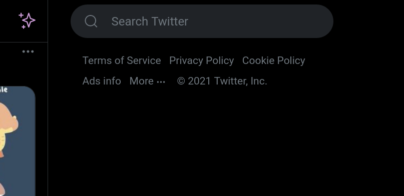

# userstyles
Custom stylesheets I made for websites that I use. You need a browser extension if you want to use these; I use [Stylus](https://github.com/openstyles/stylus#stylus)

## Picrew Image Maker Widescreen
Makes the picrew image maker fill the entire width of the page.  

The image maker shown above was made by [NUDEKAY](https://picrew.me/image_maker/395214).

## Twitter: Hide trends and follow suggestions
Hides the "What's Happening" (trending) and "Who to Follow" boxes on the right side of the Home timeline to minimize distractions.  
  

## license
`CC0` / public domain, so do whatever the hell you want
